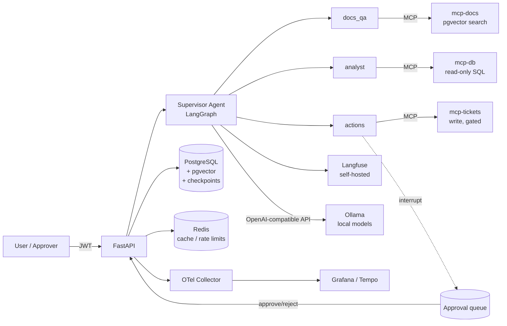

# Agentic Enterprise Platform

A production-grade multi-agent platform where AI agents resolve real enterprise workflows — answering questions over internal docs, querying databases, and proposing actions — under **role-based permissions, human approval gates, full audit trails, and continuous evaluation**.

Built to demonstrate senior-level applied AI engineering: LLMOps, security, evaluation, traceability, and production deployment.

> Full technical design: [docs/DESIGN.md](docs/DESIGN.md)

## What it does

| Use case | Agent | Guardrail |
|---|---|---|
| Q&A over internal documentation, with citations | `docs_qa` | Answers must cite retrieved chunks; faithfulness-evaluated |
| Query the analytics DB and generate a report | `analyst` | Read-only DB role, schema allowlist enforced at the MCP server |
| Create a ticket / propose an action | `actions` | **Human approval required** before execution |
| Route the request to the right specialist | `supervisor` | Only sees tools granted to the requesting user's role |

**Real datasets, reproducibly fetched** (`make data`): the documentation corpus is 8 policy pages of
the public [GitLab Handbook](https://handbook.gitlab.com) (CC BY-SA 4.0) — citations point at the
live handbook URLs — and the analytics database is [UCI Online Retail](https://archive.ics.uci.edu/dataset/352/online+retail)
(CC BY 4.0): 541,909 real transactions of a UK online retailer, with real-world messiness
(cancellations as negative quantities, guest checkouts without customer id). Eval ground truths are
computed by SQL against the loaded data.

## Architecture



**Stack:** FastAPI · LangGraph · **Ollama (local models, hardware-adaptive)** · MCP (3 custom servers) · PostgreSQL + pgvector · Redis · OpenTelemetry + Langfuse (self-hosted) · Docker / Kubernetes

## Key technical decisions

- **Fully local LLM serving with hardware-adaptive model selection** — no prompt, document, or query ever leaves the machine. At startup the platform probes GPU VRAM / RAM and picks a model tier (override with `MODEL_TIER`/`CHAT_MODEL`):

  | Tier | Hardware | Chat model | Embeddings |
  |---|---|---|---|
  | `gpu_24` | ≥ 20 GB VRAM | `qwen3:32b` | `nomic-embed-text` |
  | `gpu_16` | ≥ 12 GB VRAM | `qwen3:14b` | `nomic-embed-text` |
  | `gpu_8` | ≥ 6 GB VRAM | `qwen3:8b` | `nomic-embed-text` |
  | `cpu` | ≥ 16 GB RAM | `qwen3:4b` | `nomic-embed-text` |

  Ollama serves everything (single GPU → one resident model, requests serialized); vLLM is the documented upgrade path for multi-GPU Kubernetes serving.
- **LangGraph over OpenAI Agents SDK** — first-class human-in-the-loop via `interrupt()` and durable execution with a Postgres checkpointer: a run can pause for approval for hours and resume exactly where it stopped. Provider-agnostic.
- **MCP for all external integrations** — every tool (doc search, SQL, tickets) lives in its own MCP server. Agents never hold DB credentials; permissions are enforced at the server boundary, not by prompt engineering.
- **pgvector instead of a dedicated vector DB** — one less system to operate; Postgres already stores everything else. Swappable if scale demands it.
- **Defense in depth for permissions** — role→tool grants in the DB decide which tools the agent is even *built* with; the MCP server re-checks on every call; the SQL server connects with a read-only DB role. Three layers, no trust in the model.
- **Approval as a state, not a callback** — a run waiting for approval is a checkpointed graph state + a `pending` row. Survives restarts, has an expiry, and every decision is audited.
- **Langfuse self-hosted for LLM traces** — consistent with the local-first stack: prompt/response traces stay on your infrastructure. Runs in the same docker-compose (`observability` profile).
- **One trace ID end to end** — the OTel trace ID links the HTTP request, agent steps, MCP calls, Langfuse LLM trace, and audit log rows.

## Security model

- JWT auth; roles `admin` / `analyst` / `viewer` with DB-backed tool grants.
- Tools carry a risk tier (`read` / `write` / `critical`); `critical` always interrupts for human approval.
- Append-only `audit_log`: every tool call, approval decision, and admin change, with actor + trace ID.
- MCP servers validate inputs (SQL allowlist, SELECT-only, payload schemas) — the trust boundary is the server, not the model.

## Evaluation

- **Offline (CI gate):** golden datasets per agent — citation grounding & faithfulness for `docs_qa`, result-set correctness for `analyst`, routing accuracy for `supervisor` — scored by assertions + LLM-as-judge. A regression below threshold blocks the merge.
- **Online:** sampled production runs scored asynchronously by a judge; user 👍/👎 feedback stored per run; drift visible on dashboards.

## Results

Offline eval suite on the `gpu_8` tier (RTX 2070 8 GB, `qwen3:8b`, thinking disabled), against the
**real datasets** (GitLab Handbook corpus, UCI Online Retail) — gate **PASSED**:

| Suite | Metric | Score | Threshold |
|---|---|---|---|
| docs_qa (14 cases) | expected facts present | **0.86** | ≥ 0.80 |
| docs_qa | correct source cited (live handbook URL) | **0.86** | ≥ 0.80 |
| docs_qa | faithfulness (LLM judge) | **0.94** | ≥ 0.75 |
| analyst (8 cases) | figure matches SQL ground truth over 541k rows | **1.00** | ≥ 0.70 |
| routing (12 cases) | supervisor picked right specialist | **0.92** | ≥ 0.85 |
| actions (4 cases) | critical tool interrupted for approval (via supervisor) | **1.00** | = 1.00 |

Measured on the same hardware: docs_qa ≈ 6 s / ~2.1k tokens per run; analyst ≈ 8–20 s (multi-step
SQL over 541k rows). Online eval judges a daily sample of production runs with the same local judge.
The gate earns its keep: it caught the supervisor→subagent handoff derailing small models (hallucinated
ticket confirmations) and an analyst run answering a 2024 question with all-time figures.

Other reported metrics (Prometheus, `/metrics`): `runs_total{agent,status}`, latency histograms per
agent, `tokens_total`, `tool_calls_total{tool,status}`, `approvals_total{decision}`, approval wait time.

## Running it

```bash
cp .env.example .env    # no API keys needed — everything runs locally
make up                 # postgres (pgvector) + redis
make seed               # migrate, pull Ollama models for your hardware tier,
                        # download the real datasets (handbook pages + UCI retail) and load them
make dev                # api on :8000  (docs at /docs)
make eval               # offline eval suite with the local judge (gates CI)
make observability      # + Langfuse (:3000), Grafana (:3001), Prometheus (:9090), Tempo
```

Requires [Ollama](https://ollama.com) on the host (a GPU-passthrough compose service exists under
`--profile gpu`). Demo users: `admin|analyst|viewer@example.com` / `<role>123`.

> Linux note: if the Prometheus target for the host-run API shows `down`, your firewall is blocking
> docker-bridge → host traffic; allow the docker interface (e.g. `iptables -I INPUT -i docker0 -j ACCEPT`).

Kubernetes manifests for production in `deploy/k8s/` (API + MCP deployments, HPA, migrations job, secrets).

## Roadmap

1. ✅ Architecture & design
2. ✅ Core API: auth, RBAC tool registry, append-only audit log
3. ✅ 3 MCP servers, 4 agents, durable HITL approval flow
4. ✅ Supervisor routing + OTel/Langfuse/Prometheus wiring
5. ✅ Offline eval gate + online eval sampling (results above)
6. ✅ Docker + Kubernetes manifests (kustomize, validated)
7. Next: Grafana dashboards as code, load testing, vLLM serving path, richer eval datasets

## Repository layout

```
app/            FastAPI app: routers, auth, LangGraph agents, services, telemetry
mcp_servers/    docs / db / tickets MCP servers (stdio in dev, streamable-http in K8s)
migrations/     Alembic (schema, read-only DB role, real-data tables)
evals/          golden datasets (real ground truths), judges, offline gate, online sampler
scripts/        fetch_data (real datasets), seed, model pull
data/           downloaded datasets (gitignored, reproducible via make data)
deploy/         docker-compose (+ observability profile), Dockerfile, k8s kustomize
docs/           DESIGN.md (architecture, schema, API, agents, eval, deploy)
tests/
```
